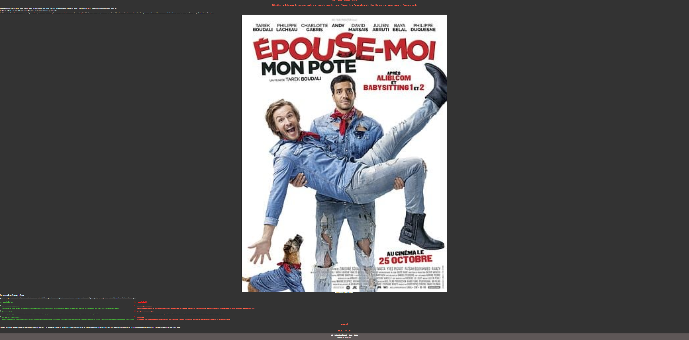

# Table des matières
1. [Membre du groupe](#membre-du-groupe)
2. [Justification du projet](#justification-du-projet)
3. [Notre motivation](#notre-motivation)
4. [URL du site](#url-du-site)
5. [logo](#logo)
6. [Description des pages](#description-des-pages)
7. [JSON](#json)
8. [Arborescence du site](#arborescence-du-site)
9. [Validation w3c](#validation-w3c)
10. [Element fait et manquant](#element-fait-et-manquant)
11. [Favicon](#favicon)
12. [Auto-évaluation](#auto-évaluation)
13. [Note du projet](#note-du-projet)

# Membre du groupe

Paul Michaux (paul.michaux9@etu.univ-lorraine.fr) et Lilou Toussaint-Erraes (lilou.toussaint-erraes5@etu.univ-lorraine.fr). Nous somme dans le TP3.

# Justification du projet

Le nom _Cinéfolie_ vient du fait que notre site traite de l'actualité autour de l'industrie du cinéma et des séries. Or dans cette industrie il se passe de plus en plus de chose tous les jours ce qui devient comme une "folie". D'ou le nom _Cinéfolie_. Qui plus est, sur certaines de nos reviews, un personnage fictif interagit avec les auteurs, ce qui fait que ce personnage, nommé Alter, est aussi une petite folie de notre part.

Concernant l'objectif du site, il est d'informer les internautes de l'actualité, de faire des reviews, présenter des anecdotes et vendre des goodies sur l'industrie du cinéma et des séries.

# Notre motivation

Elle vient du fait que les sites d'information autour du cinéma et des séries ne sont pas de nos goût donc on a voulut faire un site d'information à notre goût, regroupant les meilleurs points des autres sites en un seul.

# URL du site

l'URL est la suivante : http://webetu.iutnc.univ-lorraine.fr/~e50199u/sae105-cinefolies/index.html ou http://webetu.iutnc.univ-lorraine.fr/~e34649u/sae105-cinefolies/index.html

l'URL du site dynamique est la suivante : http://webetu.iutnc.univ-lorraine.fr/~e50199u/sae105-cinefolies/dynamique/index.html ou http://webetu.iutnc.univ-lorraine.fr/~e34649u/sae105-cinefolies/dynamique/index.html

l'URL du site statique est la suivante : http://webetu.iutnc.univ-lorraine.fr/~e50199u/sae105-cinefolies/statique/index.html ou http://webetu.iutnc.univ-lorraine.fr/~e34649u/sae105-cinefolies/statique/index.html

# Logo

Il représente une boite de pop-corn avec du pop-corn qui déborde. Les étoile rappellent Hollywood

# Description des pages
## Index

Ceci est la page d'accueil du site _Cinéfolie_. On retrouve en haut centré au milieu la barre de navigation pour naviguer entre les différentes pages. En dessous toujours centré on retrouve le nom du site. Encore en dessous on a un texte défilant en jaune un petit texte qui informe le lecteur sur ce qu'est le site. En dessous il y a le containeur avec des _cards_. Le containeur est rouge pour rappeler l'ambiance des salles de cinéma tout comme les titres dans les _cards_. La date de parution est en blanc. Un bouton détaille est présent que si on passe la souris dessus devient jaune. Quand on clique dessus le bouton nous amène vers une autre page qui est la page de l'article. L'affichage de ces _cards_ est faite dynamiquement avec du javascript.

Enfin le footer est gris clair pour le faire ressortir à l'écran. C'est dans cette partie que l'on retrouve les liens pour les CGU, politique de confidentialité, la licence et l'accès à ce readme. En dessous de cela on retrouve celui qui à fait la page.

Cette page à était faite avec du HTML, CSS et du javascript.

## Review

On retrouve ici la page d'accueil des reviews. On retrouve la barre de navigation et le titre de la page. On retrouve aussi 2 containeurs, un pour les reviews des films et un autre pour les séries. Tous le reste à était dit dans la description de la page d'accueil/index. Tout marche de la même manière. 

Cette page à était faite avec du HTML, CSS et du javascript.

## Reviews Les Tuche

Ceci est la présentation de la reviews sur le film _Les Tuche_. On retrouve la barre de navigation et le titre de l'article. 

Il y a ensuite un texte qui dit la distribution principale et les rôles des acteurs.

Il y a un autre texte qui raconte le synopsis du film puis vient l'affiche du film. Puis il y a un autre petit texte. Il y a ensuite les points fort écrits en vert avec des puces mise à notre goût. Les points faible sont eux écrits en rouge avec des puces stylisées. Vient ensuite le verdict et la note.

Le footer lui ne change pas.

Cette page à était faite avec du HTML et du CSS

## Autre reviews

Toutes ces page sont identique dans le fond. Elles sont exactement pareil dans le fond que la page sur la reviews du film _Les Tuche_. Il y a juste un changement dans les textes et les images

Ces pages ont étaient faites avec du HTML et du CSS.

## CGU, licence et politique de confidentialité

Page CGU faite par Paul

Page licence faite par Paul

Page politique de confidentialité faite par Paul

Ces 3 pages fonctionnent comme les pages reviews.

## Boutique

Cette page fonctionne comme la page d'acceil et est présentée de la même façon pour rester dans le thème du cinéma et des séries. Petite spécificité ici est que l'on peut trié les articles en fonction de leur nature. Le bouton "ajouter au panier" permet d'afficher à l'écran un petit message disant que l'article a été ajouté au panier. Il y a aussi un formulaire pour la création d'un compte.

# JSON

### Paul

Ceci est le JSON de la page Boutique. On retrouve comme première donnée "Image" qui sert ici à compléter la fin du chemin relatif pour accéder à l'image voulut. "TxtAlt" sert au text alternatif si l'image ne se charge pas. "Titre" sert a mettre la description du produit pour bien savoir ce que c'est. "Prix" est un tableau de prix qui sert a savoir le prix que le client va payer avec les prix affiché en euro, en dollar américan et canadien et en livre sterling. "Genre" n'est pas affiché dans la _card_ final mais il sert quand on veux trier les articles par genre pour avoir par exemple juste les t-shirts affichés.

### Lilou

Les clés "Image", "TxtALt" et "Titre" ont la même fonction que précédemment. Seule la clé "LienPage" sert elle à compléter le chemin relatif pour accéder à la page de la review.

# Arborescence du site

# Validation w3c
## Page index

## Page anecdote

## Page Boutique

## Page CGU, licence, politique de confidentialité

## Page annonce autour des Tuche

L'erreur ici n'est pas une erreur car j'ai repris le code d'intégration de la vidéo Youtube directement sur le bouton partager de la page de la vidéo Youtube.

## Page Jamais sans mon psy

## Page reviews

## Page où l'on donne notre avis

# Element fait et manquant
## Element fait
Les langages web utilisé ont été le HTML, CSS et JS. Tous les codes été écrits selon les règles et conventions en vigueur. VSCode à été utilisé pour faire ce site, le site ne contient aucune connotation inderdite, le nom du dossier principale est "sae105-cinefolies", l'arborescence a été respecté. Notre workspace est nommé sae105, la page principale est nommé "index.html", les pages ont été validés W3C, toutes les pages sont signées par le nom de l'étudiant qui l'a conçu, tout a été fait pour l'accessibilité, une barre de navigation est présente sur toutes les pages, le format webp a été utilisé, toute la mise en forme a été faite avec du CSS externe, les images ont été implantés en html pour celles qui étaient sémentique et en CSS pour les images décoratives. Les JSON sont de tailles significatives, chacun de nous à fait un JSON différent, toutes les pages dynamiques ont été générées en parcourant et en sélectionnant des éléments dans les fichiers JSON. Le site a été mis en ligne via l'extention SFTP de VSCode, le Readme à été fait via VSCode.

## Element manquant
Le site n'est pas de largeur fixe, le manque de commentaire, aucune police hébergé en ligne n'a été utilisé

# Favicon

C'est le logo en plus petit

# Auto-évaluation
## Tâche effectué
### Paul
Je me suis occupé d'héberger le workspace, de voir si toute la nomenclature des fichier était correct, j'ai fait la majorité des pages, de leurs CSS et si besoin leurs JSON et JS, j'ai aussi fait ce readme et le htaccess

### Lilou
Elle s'est occupée de quelque pages, de leurs CSS et si besoin leurs JSON et JS. Elle à fait le logo et le favicon. Elle à réfléchie au couleurs et à tout le visuel du site, elle à fait les images des pages d'erreur 403 et 404

## Pourcentage
### Paul
Je pense avoir fait 65% des tâches au globale sur ce projet. En intégration je pense avoir contribué à 70%, en développement web à 80% et en hébergement à 80%

### Lilou
Elle a fait 35% des tâches au globale sur ce projet. En intégration, elle a contribué à 30%, en developpement web à 20% et en hébergement à 20%.

## Note
### Paul 
Pour l'intégration, je pense avoir 14/20, en developpement web je pense avoir 14/20 et en hébergement je pense avoir 14/20. Donc globalement sur ce projet, je pense avoir 14/20.

### Lilou
Pour l'intégration, elle pense avoir 12/20, en developpement web elle pense avoir 13/20 et en hébergement, elle pense avoir 12/20. Donc globalement elle pense avoir 12,5/20 pour cette saé.

# Note du projet
Ce projet mérite d'avoir 14/20.